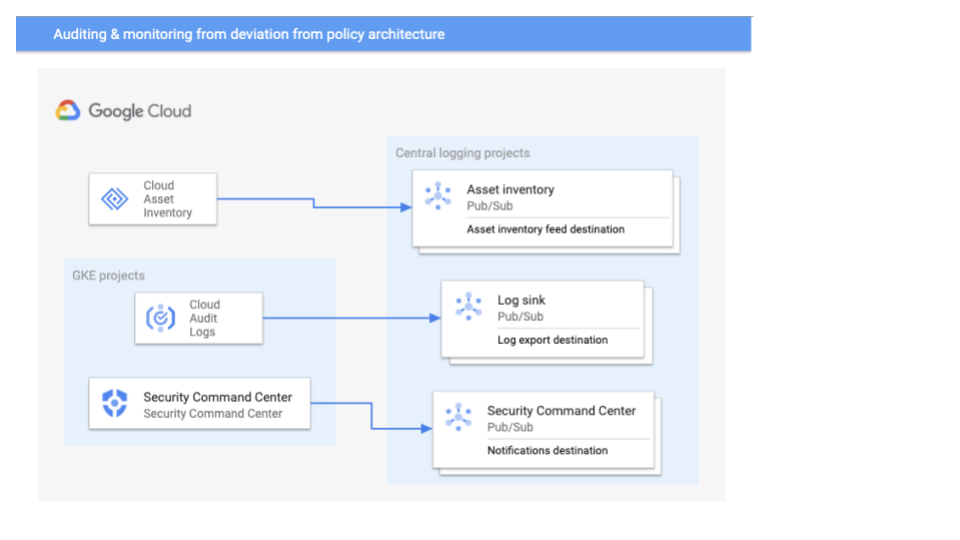

# Anthos Security blueprint Auditing and monitoring for deviation from policy - Implementation steps


These instructions provide a prescriptive way to implement the infrastructure to audit and monitor deviation from policies that you've configured in your Anthos GKE clusters. For background information about what you will configure, see [Anthos security blueprint: Auditing and monitoring for deviation from policy](https://cloud.google.com/architecture/blueprints/anthos-auditing-and-monitoring-for-deviation-from-policy-blueprint).

The instructions assume that you have basic familiarity with the following Google Cloud products: 


*   [Cloud Monitoring](https://cloud.google.com/monitoring)
*   [Cloud Logging](https://cloud.google.com/logging)
*   [Identity and Access Management (IAM)](https://cloud.google.com/iam)
*   [Security Command Center](https://cloud.google.com/security-command-center)

The instructions also assume you have basic familiarity with Terraform.


## Prerequisites

Before you proceed, do the following: 


*   Follow the setup steps in the `~/anthos-security-blueprints/README.md` file. This ensures that you have Terraform installed on your admin workstation configured to manage Google Cloud resources.
*   Follow the steps in [Enforcing Policy implementation](https://github.com/GoogleCloudPlatform/anthos-security-blueprints/tree/master/enforcing-policies) to apply policies using Policy Controller.
*   Make sure that you have permissions to configure IAM roles. Implementing some of the controls described in this document requires elevated permissions at the project and organization level. You might need to work with your security admin to complete the steps.
*   Enable the following APIs for the project that the service account you use to create resources managed by Terraform:
    *   Cloud Resource Manager API (`cloudresourcemanager.googleapis.com`)
    *   Cloud Billing API (`cloudbilling.googleapis.com`)
    *   Identity and Access Management API (`iam.googleapis.com`)
    *   Service Usage API (`serviceusage.googleapis.com`)
    *   Cloud Logging API (`logging.googleapis.com`)
    *   Cloud Storage JSON API (`storage-api.googleapis.com`)
    *   Cloud Pub/Sub API (`pubsub.googleapis.com`)
    *   BigQuery API (`bigquery.googleapis.com`) (optional—you only need this if you want to  push events and logs to BigQuery)

The following diagram illustrates what the architecture looks like if you configure all the event sources to send all data to a single project that has multiple Pub/Sub endpoints. The steps outlined in this README file do not create the single project, but instead assume you have already created that project.





## Configure a central log sink at the Google Cloud organization level

If you  created your Google Cloud organization using the [Example foundation](https://github.com/terraform-google-modules/terraform-example-foundation/tree/master/1-org/envs/shared) Terraform scripts, you can skip this procedure.


1. Grant the following permissions to the service account that you will use to create Terraform managed resources.

    At the Google Cloud organization level:

*   `Logging/Logs configuration writer permission `

    In the project where the log export destination will be created:

*   `roles/serviceusage.serviceUsageAdmin`
*   `roles/pubsub.admin`
*   `roles/serviceAccountCreator`
*   `roles/serviceAccountDeleter`
*   `roles/logging.Admin`
2. In the local clone of the repository, change to the `~/audit-monitor/logsink` folder.
3. Update the `terraform.tfvars` file with the following values:
*   `project_id`: The ID of the Google project in which the log export destination will be created.
*   `parent_resource_id`: The ID of the resource in which the log sink will be created. 
*   `parent_resource_type`: The resource type in which the log sink will be created. This can be a project, a folder, or the organization.
4. Create a log sink that filters for GKE events :

    ``` 
    terraform init
    terraform plan
    terraform apply 
    ```

    These commands use the Terraform template in the `~/audit-monitor/logsink` folder. 


    Doing this step provisions the following: 

*   An aggregated log export at the organization level
*   A Pub/Sub topic destination
*   A service account that the logging process uses to write log entries to the destination

    The template file uses the [Terraform Google cloud log-export module](https://registry.terraform.io/modules/terraform-google-modules/log-export/). If you want to use a log sink other than Pub/Sub, you can reference the module to adapt the Terraform template to your requirements.


## Configure a Cloud Asset Inventory feed at the Google Cloud organization level

This procedure is applicable only for Anthos GKE clusters that are deployed on Google Cloud.  The procedure assumes that you have not activated [Cloud Asset Inventory](https://cloud.google.com/asset-inventory) against your Google Cloud organization. If you have done this process and have already configured a feed, you can skip this step. 

The template file uses the [google_cloud_asset_organization_feed resource](https://registry.terraform.io/providers/hashicorp/google/latest/docs/resources/cloud_asset_organization_feed) 

**Note**: The account you are using must have permissions to create a Cloud Asset Inventory  feed at the Google Cloud organization level. 


1. In the project where you will create the Pub/Sub topic destination, grant the following permissions to the service account that you will use to create Terraform managed resources in the project:
*   `roles/pubsub.admin`
*   `roles/serviceAccountCreator`
*   `roles/serviceAccountDeleter`
*   `roles/iam.roleadmin`
1. In the local clone of the repository, change to the `~/audit-monitor/cloud-asset` folder.
2. Update the `terraform.tfvars` file with the following values:
*   `org_id`: The ID of the Google Cloud organization for the cloud asset inventory feed.
*   `project_id`: The ID of the Google project in which the Pub/Sub topic for the feed outputs will be created.
3. Create a Pub/Sub topic as the destination that Cloud Asset Inventory sends notifications to:

    ```
    terraform init
    terraform plan
    terraform apply
    ```


    These commands  use the Terraform template in the `~/audit-monitor/cloud-assets` folder.


    Doing this step provisions the following: 

*   A Pub/Sub topic destination and an associated subscriber
*   A service account that Cloud Asset Inventory uses to write entries to the destination.
*   A Cloud Asset Inventory feed at your organization level. 

   


## Configure notifications from Security Command Center

You usually configure Security Command Center notifications when you configure a Google Cloud organization for use by your organization. If the Security Command Center notification has already been implemented, you can skip this section.

Note: If you want to monitor for constraints that are out of compliance with supported regulations, you must be subscribed to Security Command Center Premium tier.


1. In the project that contains the Pub/Sub topic that will receive the findings, grant the following permissions to the service account that you will use to create Terraform managed resources:
*   `roles/pubsub.admin`
2. Grant the following permissions to the service account that you use to configure the Security Command Center notification:

    At the Google Cloud organization level:

*   `resourcemanager.organizationAdmin`. For more information, see [managing organizations](https://cloud.google.com/resource-manager/docs/creating-managing-organization).
*   `securitycenter.admin`. Add this role for yourself even if you're the organization owner.

    In the project where the Pub/Sub feed receiving the findings will be created:

*   `roles/pubsub.admin`
3. In the local clone of the repository,  change to the `~/audit-monitor/scc_notification` folder.
4. Update the `terraform.tfvars` file with the following values:
*   `org_id`: The ID of the Google Cloud organization for the Cloud Asset Inventory feed.
*   `project_id`: The ID of the Google project in which the Pub/Sub topic for the feed outputs will be created.
5. Create a Pub/Sub topic as the destination that receives findings:

    ```
    terraform init
    terraform plan
    terraform apply
    ```


    These commands use the Terraform template in the `~/audit-monitor/cloud-assets` folder


    Doing this step provisions a Pub/Sub topic destination and an associated subscriber.

6. Create a Security Command Center notification by running the `gcloud` command that was created by the `terraform output` statement. The `gcloud` command looks similar to the following:

    ```
    gcloud alpha scc notifications create scc-notification \
        --organization YOUR-ORG-ID \
        --description "SCC Notification for all active findings" \
        --pubsub-topic projects/YOUR-PROJECT-ID/topics/scc-notify \
        --filter "state=\"ACTIVE\"" \
        --project "YOUR-PROJECT-ID" 

    ```


## How to use the auditing environment

This section describes ways in which you can use the logging and monitoring infrastructure that you've configured. 


### Auditing compliance with policies

If you already had resources deployed into your cluster when you applied a set of constraints, you can use [Gatekeeper audit](https://github.com/open-policy-agent/gatekeeper#audit) functionality to identify out-of-compliance resources. Gatekeeper constantly audits the status of your cluster's objects. 

To get the list of resources that are identified by Gatekeeper, from your admin workstation, in the local clone of the repo, run the following command:


```
kubectl get constraint
```


This command lists the constraints that are applied to your clusters. The listing includes the status of the constraints, which will have a record of any violations.


### Monitoring deviation from policy using Cloud Logging

If monitoring has not been enabled, follow the instructions for your Anthos GKE cluster type to enable monitoring and logging:


*   If you are running GKE on Google Cloud, configure [Kubernetes Engine Monitoring](https://cloud.google.com/monitoring/kubernetes-engine/installing#migrating).
*   If you are running GKE on-prem, [use Kubernetes Engine Monitoring for logging and monitoring](https://cloud.google.com/gke-on-prem/docs/concepts/logging-and-monitoring#stackdriver_requirements).

To see information about deviation from policy, do the following:


*   Query [sensitive admin activities](https://cloud.google.com/kubernetes-engine/docs/how-to/audit-logging#example_filters_for_your_admin_activity_log) and [Anthos service mesh audited operations](https://cloud.google.com/service-mesh/docs/audit-logging#audited_operations) for each of the projects where your Kubernetes clusters are deployed on Google Cloud by[ filtering the Admin Activity log](https://cloud.google.com/kubernetes-engine/docs/how-to/audit-logging#example_filters_for_your_admin_activity_log).
*   Query Kubernetes logs that record activities such as events written to the control plane logs by using [the example queries](https://cloud.google.com/logging/docs/view/query-library-preview#kubernetes-filters).


### Configuring alerts for Cloud Logging events

The log sink whose[ filter ](https://cloud.google.com/kubernetes-engine/docs/how-to/audit-logging#filtering_your_admin_activity_log_by_resource_type)matches the log entry writes a copy of the log entry to that sink's export destination. You can create an event-driven system to detect and respond to log events in real time by using a [Logging sink](https://cloud.google.com/logging/docs/export) [integrated](https://cloud.google.com/logging/docs/export/using_exported_logs#pubsub-overview) with [Pub/Sub](https://cloud.google.com/pubsub) and [Cloud Functions](https://cloud.google.com/functions).

For example, the filter based on the following query will return all audit messages related to your GKE on Google cloud clusters:


```
resource.type="gke_cluster"
AND
log_name="projects/[your-project-id]/logs/cloudaudit.googleapis.com%2Factivity"
```


For more information about implementing this approach, see the following resources:


*   [Automate your response to a Cloud Logging event](https://cloud.google.com/blog/products/management-tools/automate-your-response-to-a-cloud-logging-event) 
*   [terraform-google-modules/terraform-google-event-function: Terraform module for responding to logging events with a function](https://github.com/terraform-google-modules/terraform-google-event-function)


### Configuring notifications from Security Command Center

When you define the [source filter](https://cloud.google.com/security-command-center/docs/how-to-api-filter-notifications#setting_up_a_source_filter) to specify the provider findings, you can use the [container vulnerability findings](https://cloud.google.com/security-command-center/docs/concepts-vulnerabilities-findings#container-findings) to define alternative filters. To configure remediation actions for any findings, you can create [automations](https://github.com/GoogleCloudPlatform/security-response-automation/blob/master/automations.md) that implement the appropriate actions against GKE findings.
