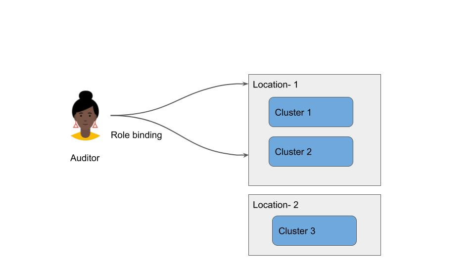

# Anthos Security blueprint: Enforcing locality restrictions - implementation steps

IMPORTANT: To be able to successfully follow the instructions detailed here you must have followed the setup steps detailed in the ~/anthos-blueprints/README.md in the repo.

These instructions provide a prescriptive way to implement  the guidance outlined in 

[Anthos Google Cloud security Enforcing locality restrictions](https://cloud.google.com/architecture/blueprints/anthos-enforcing-locality-restrictions-blueprint) blueprint guide .

The implementation steps detailed do not include how to  configure a [Google Cloud Armor security policy](https://cloud.google.com/armor/docs/configure-security-policies) that is  described in the [Anthos Google Cloud security Enforcing locality restrictions](https://cloud.google.com/architecture/blueprints/anthos-enforcing-locality-restrictions-blueprint) blueprint guide .

The steps detailed below are carried out using your local admin workstation which you configured in the prepare your admin workstation prerequisites steps detailed in ~/anthos-blueprints/README.md

Note: If you have already carried out some of the steps such as defining your namespace hierarchy you can skip those steps when you get to them.


## Restricting the locations where you can deploy your cluster

To effectively apply the guidance detailed here you should complete the following steps prior to creating your  hardened cluster . 


1.  Use the [Value groups table](https://cloud.google.com/resource-manager/docs/organization-policy/defining-locations#value_groups)  to list the allowed locations for your cluster (  zonal,regional or multi regional) multi-regions such as Asia and Europe, regions such as `us-east1` or `europe-west1`, or individual zones such as `europe-west1-b`. Every location to be allowed should be included in your list
1.   Modify the example locality-policy file  in the locality-restricted folder of this repo with the  allowed values that meet your requirements that you listed in step
1.  Grant yourself the  [Organization Policy Administrator](https://cloud.google.com/resource-manager/docs/organization-policy/using-constraints#add-org-policy-admin)  IAM permission <code>[roles/orgpolicy.policyAdmin](https://cloud.google.com/iam/docs/understanding-roles#organization-policy-roles)</code>  . If you are unable to do this, request that your organization administrator grants you the permission or carries out the next step on your behalf. 
1.  Apply the modified policy file

    ```
    gcloud beta resource-manager org-policies set-policy \
        --organization 'ORGANIZATION_ID' \
        locality-policy.yaml

    ```


Where:


*   **[ORGANIZATION\_ID](https://cloud.google.com/resource-manager/docs/organization-policy/defining-locations#retrieving_customer_id)** is the ID of the organization node to set this policy on.
*   **locality-policy.yaml** is the .yaml file containing the organization policy you want.

At this stage you can create your Anthos on Google cloud  private GKE cluster following the [GKE hardening your cluster](https://cloud.google.com/kubernetes-engine/docs/how-to/hardening-your-cluster#restrict_with_network_policy)


## Restricting the locations that can access the Kubernetes API server

If you created your cluster with authorized networks  then you can skip these steps


5.  List the CIDR values for the networks you want to restrict access to the Cluster end point via HTTPS ( a maximum of 50) 
1.  Using the list of CIDR  values listed in the previous step restrict access to the Cluster endpoint by running the following command against your clusters using a comma separated list containing each CIDR authorized replacing cidr with valid cidr values such as 8.8.8.8/32 , 8.8.8.8/24 

    ```
    gcloud container clusters update cluster-name \
        --enable-master-authorized-networks \
        --master-authorized-networks cidr,cidr

    ```
    A Terraform example to create a [private cluster ](https://github.com/terraform-google-modules/terraform-google-kubernetes-engine/blob/master/examples/private_zonal_with_networking/main.tf#L70-L75) is avaialable


## Restricting who can access your clusters

To restrict who can access clusters you use Anthos config management to configure  a policy that uses a Rolebinding that binds to clusters that have the requisite label.

This part of the configuration assumes you have  configured each cluster's ACM operator to point to the config-root in anthos-security-blueprints as per the prerequisites steps detailed in ~/anthos-blueprints/README.md

The template files in this repo assume you are restricting the access for an  auditor to two clusters located in location-1. The clusters in location-1  are in separate environments prod and dev. 

The auditor has no access to cluster 3 in location 2. The diagram below depicts the configuration.





 The steps below configure a RoleBinding named `Auditor` which is restricted to clusters 1 and  2 in Location 1.


### **Creating ClusterSelectors and Cluster Configs**

The template files provided are 

~/anthos-blueprints/enforcing-locality/cluster/clusterrole.auditor.yaml

~/anthos-blueprints/enforcing-locality/cluster/clusterrolebinding.auditors.yaml

~/anthos-blueprints/enforcing-locality/clusterregistry/cluster.your-location.yaml

~/anthos-blueprints/enforcing-locality/clusterregistry/cluster.your-2nd-location.yaml

~/anthos-blueprints/enforcing-locality/clusterregistry/clusterselector.select-location-your-location.yaml

~/anthos-blueprints/enforcing-locality/clusterregistry/clusterselector.select-env-prod.yaml

~/anthos-blueprints/enforcing-locality/clusterregistry/cluster.your-location-2.yaml  ( required if using section on observing enforcement )

`ClusterSelectors` are used to rollout policy to specific clusters. For `ClusterSelectors` to work, clusters must be labeled with relevant metadata. [Read more about ClusterSelectors here.](https://cloud.google.com/anthos-config-management/docs/how-to/clusterselectors)

.`ClusterSelectors` limit which clusters a config applies to by checking the cluster's labels. `ClusterSelectors` must reference labels associated with a cluster. 

The `Cluster` configs are located in the clusterregistry/ directory.

ACM uses the `metadata.name` field to determine where `ClusterSelectors` apply.


7.  Update the cluster's names in the `metadata.name` field with your values in the config  files in the ~/anthos-blueprints/enforcing-locality/clusterregistry/ folder
1.  Copy your updated config files to the corresponding config-root/clusterregistry where the ACM operator for each cluster is synched to 


### **Applying Cluster Configs**

Push your changes to your repo for them to be picked up by ACM.

First, ensure your cluster configs are valid.


```
$ cd config-root/
$ nomos vet
# Commit and push changes to git
$ git add clusterregistry/
$ git commit -m "updated cluster configs to point to my clusters"
$ git push origin master
```


## 
**Creating RoleBinding**

This config creates a `RoleBinding` named `auditor` that only applies to clusters that  match the label that defines the location you are restricting your auditor's access to.

The `ClusterRole` "auditor" references "select-location-[add-your-location]" in the `annotations.configmanagement.gke.io/cluster-selector` field. The "auditor" role is created only in clusters with the "location: [add-your-location] label. So if the location you want to restrict the auditor to have access to is london you would replace the placeholder [add-your-location] with London

  This will also apply to the `ClusterRoleBinding` "auditors".


9.  Modify the following as indicated in the comments within each file to reflect your values

~/anthos-blueprints/enforcing-locality/cluster/clusterrole.auditor.yaml

~/anthos-blueprints/enforcing-locality/cluster/clusterrolebinding.auditors.yaml

If for example if you had updated the following config files  to have a  location of london then you need to reflect that change  in the above 2 files

~/anthos-blueprints/enforcing-locality/clusterregistry/cluster.your-location.yaml

~/anthos-blueprints/enforcing-locality/clusterregistry/cluster.your-location-2.yaml

~/anthos-blueprints/enforcing-locality/clusterregistry/clusterselector.select-location-your-location.yaml


10.  Copy your updated config files to the corresponding config-root/cluster folder in your  repo  where the ACM operator for each cluster is synched to 


### **Applying Rolebinding**


11.  Commit and push changes to your repo


```
$ cd config-root/
$ nomos vet
# Commit and push changes to git
$ git add cluster/
$ git commit -m "Add auditor role to clusters in selected locations"
$ git push origin master
```


## Observe Enforcement Across Clusters 

This section is to help you validate your configuration. It assumes that you created an additional  test cluster that is in a separate location from the location the `ClusterRole` "auditor" references. The additional cluster uses values set in ~/anthos-blueprints/enforcing-locality/clusterregistry/cluster.your-2nd-location.yaml 

First verify that the "auditors" `ClusterRoleBinding` exists in clusters with a "location label that you assigned to  your clusters which we will refer to as cluster 1 and cluster 2 in location-1. Replace these values with your actual values

Repeat the following for both clusters in location-1.

Ensure your kubectl context is pointing to  cluster 1 ( or cluster 2)  \
`# update local kubeconfig to correct cluster`


```
$ gcloud container clusters get-credentials <cluster 1 or cluster-2 cluster name> --zone <cluster zone>
# ensure kubectl is using correct context

```


12.  `$ kubectl config get-context`

Get ClusterRoleBinding with `kubectl \
$ kubectl get clusterrolebinding auditors`

On success you should observe a message similar to 


```
NAME         AGE

```


13.  `auditors     5m`

Next, let's verify that the "auditors" `ClusterRoleBinding` does not  exist in the test  clusters with different location labels. 

Ensure your kubectl context is pointing to correct cluster \
`# update local kubeconfig to correct cluster`


```
$ gcloud container clusters get-credentials <tcluster-3 cluster name> --zone <cluster zone>
# ensure kubectl is using correct context

```


14.  `$ kubectl config get-context`

Get ClusterRoleBinding with `kubectl \
$ kubectl get clusterrolebinding auditors`

On success ( auditor cannot access) you will observe the following error


```
      Error from server (NotFound): clusterrolebindings.rbac.authorization.k8s.io "auditors" not found